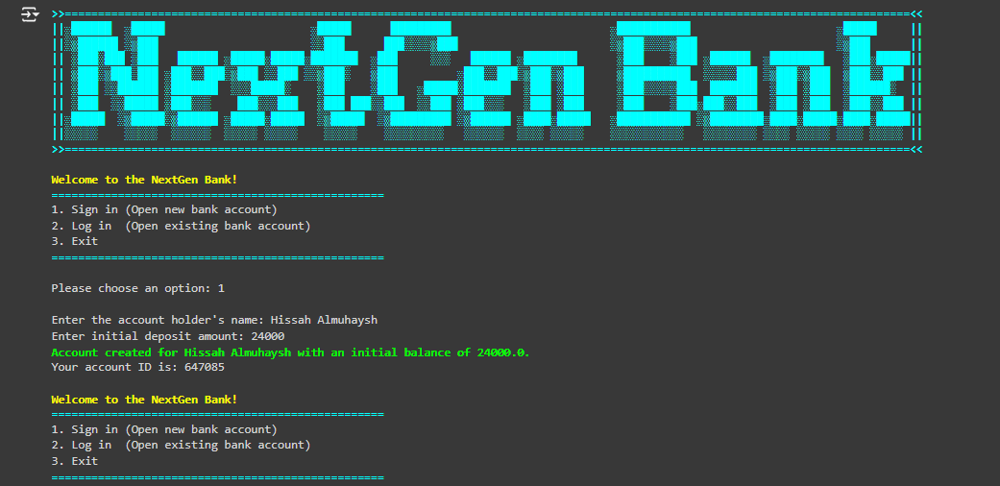

# Basic Bank Account System

This project involves developing a Basic Bank Account System that allows users to perform fundamental banking operations such as creating an account, depositing money, withdrawing money, and checking their account balance. The system is designed to be simple, user-friendly, and efficient, making it ideal for understanding basic financial operations and programming concepts.

## Features

- **Account Creation**: Users can create a new bank account by providing necessary details such as name, account number, and initial deposit.
- **Deposit Funds**: Users can deposit money into their accounts, with the system updating the balance accordingly.
- **Withdraw Funds**: Users can withdraw money from their accounts, with checks to ensure sufficient funds are available.
- **Check Balance**: Users can view their current account balance at any time.

## Technology Stack
- **Programming Language:** Python.

## Screenshots

<div style="display: flex; gap: 10px;">
  
</div>

## Contributing
If you want to contribute to this project, feel free to open issues or submit pull requests. Your feedback and contributions are highly appreciated!

## Contact
For any questions or feedback, you can reach out to me at [Hissah.khalid@hotmail.com](mailto:Hissah.khalid@hotmail.com). 

## License
 ```bash
  Copyright 2024 Hissah Khalid.
